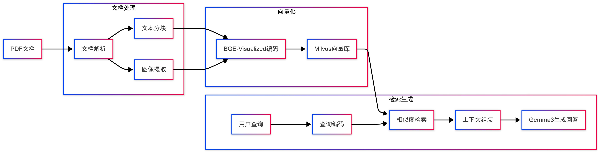

# 多模态检索生成增强(Multimodal RAG)
## 背景介绍

在当今的AI应用中，单纯依赖大语言模型的知识库已经不能满足复杂场景的需求。特别是在处理包含图片、表格等多模态内容的文档时，我们需要一个能够理解并结合多种信息类型的系统。这就是为什么我们需要多模态RAG(检索增强生成)系统。
本教程通过使用包含图片、文本和表格的 PDF 文件来实现多模态 RAG 系统。该 PDF 文件就是前面在 RAG 定义中提到的外部信息源。系统设置完成后，模型将能够根据所提供 PDF 文件中的图像、文本和表格生成响应。

本项目是一个基于开源技术的多模态检索系统实践案例，构建了一个聊天Demo应用。用户上传PDF后，可进行文本或图片内容的问答交互。项目使用了Gemma3-27b、Milvus、Visualized BGE Embedding模型和FastAPI框架，未依赖Langchain、LlamaIndex等成熟工具，旨在通过底层组件的整合，探索多模态检索系统的设计与实现，适合学习和技术研究。

## 解决方案架构

我们的解决方案包含以下核心组件：

1. 文档处理器：使用pypdfium2, PyMuPDF 解析 PDF 文件，提取文本和图像
2. 多模态嵌入模型：采用 BGE-Visualized 模型，可以同时处理文本和图像内容
3. 向量数据库：使用 Milvus 存储和检索多模态向量
4. 生成模型：使用 Gemma-3-27b 模型生成最终回答

系统工作流程：



## 环境准备

### 依赖安装

首先需要安装必要的依赖包:
```
pip install -r requirements.txt
```

### BGE-Visualized模型准备

#### 克隆代码仓库
```
git clone https://github.com/FlagOpen/FlagEmbedding.git
cd FlagEmbedding/research/visual_bge
pip install -e .
```

#### 下载模型权重
你需要从以下链接下载预训练模型权重:

英文模型:
- 模型权重: [Visualized_base_en_v1.5.pth](https://huggingface.co/BAAI/bge-visualized/blob/main/Visualized_base_en_v1.5.pth)
- 基础模型: [bge-base-en-v1.5](https://huggingface.co/BAAI/bge-base-en-v1.5)

多语言模型:
- 模型权重: [Visualized_m3.pth](https://huggingface.co/BAAI/bge-visualized/blob/main/Visualized_m3.pth)
- 基础模型: [bge-m3](https://huggingface.co/BAAI/bge-m3)

国内下载可通过魔搭社区下载，速度更快:
- [Visualized_base_en_v1.5.pth](https://www.modelscope.cn/models/BAAI/bge-visualized/file/view/master?fileName=Visualized_base_en_v1.5.pth&status=2)
- [Visualized_m3.pth](https://www.modelscope.cn/models/BAAI/bge-visualized/file/view/master?fileName=Visualized_m3.pth&status=2)

下载后将模型文件放置在项目的 `./models/` 目录下:
```
mkdir -p ./models
mv Visualized_base_en_v1.5.pth ./models/
mv Visualized_m3.pth ./models/
```
## 如何使用
```
cd app
uvicorn main:app --reload
```